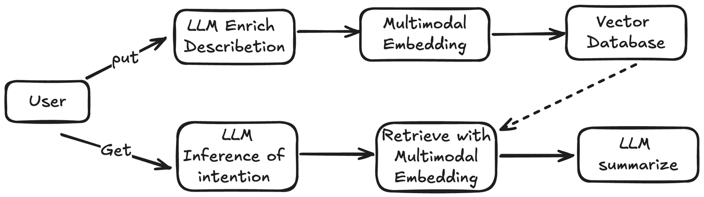
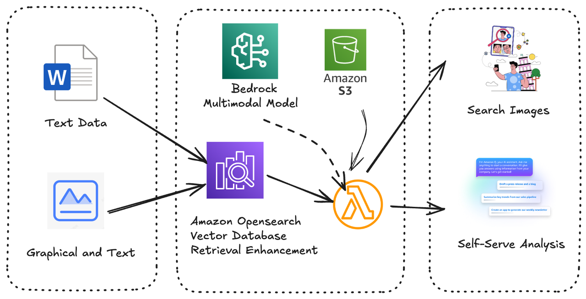

# Images 多模态RAG 应用Workshop

#### 业务背景

电商场景中，用户希望通过输入图片，用以图搜图/文搜图/图+文搜图的方式可快速在图片库中检索到与输入图片相似的图片集合。可广泛应用于拍照购物、商品推荐、电商选品、产品设计管理等场景。

图片搜素的三个需求：

1. 根据整张图片搜索近似图片列表，并根据相似度排序；
2. 根据局部图片从图片库中搜索包含局部图片的列表，并根据匹配度排序；
3. 根据整张图的局部特征描述搜索近似图片列表，并根据匹配度排序。

传统方案的挑战：

1. 通过图片的关键词做纯文本检索，无法完全捕捉图片细节，通常取决于文本内容。然后大部分图片的描述信息又会有很多重复；
2. 通过小模型的图片特征匹配，维度较少，匹配精度不高；
3. 通过纯图片的向量化召回，无法根据特定的细节进行匹配，如描述一个图片里局部的匹配；

## 架构说明





## 本地开发说明

cd lambda

uvicorn index:app --reload

## 部署说明

前提：安装python 版本>3.9 npm 及cdk

Amazon linux 2023 参考

```
yum install npm
npm install -g aws-cdk
npm install docker 
service docker start

```
执行部署的必要权限：

修改 images-rag-workshop/cdk.context.json `callerArn` 为执行权限

This is a blank project for CDK development with TypeScript.

The `cdk.json` file tells the CDK Toolkit how to execute your app.

cd lambda

sh build.sh

cd ..

aws ecr-public get-login-password --region us-east-1 | docker login --username AWS --password-stdin public.ecr.aws

npm install

cdk bootstrap

cdk deploy

## Useful commands

* `npm run build`   compile typescript to js
* `npm run watch`   watch for changes and compile
* `npm run test`    perform the jest unit tests
* `npx cdk deploy`  deploy this stack to your default AWS account/region
* `npx cdk diff`    compare deployed stack with current state
* `npx cdk synth`   emits the synthesized CloudFormation template
